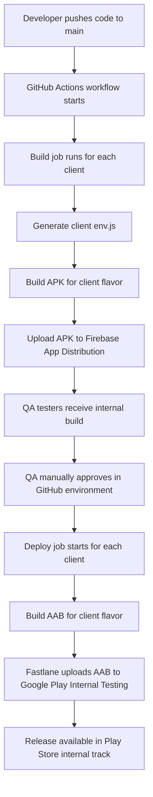

# DevOps Architecture: Multi-client Android Release System

## 1. Purpose

This architecture reflects the actual deployment flow implemented in [.github/workflows/android-build.yml](.github/workflows/android-build.yml).

The release process is divided into three main stages:

1. Build APKs for each client and distribute them through Firebase App Distribution for internal QA testing.
2. Pause the pipeline for manual QA approval through a GitHub environment.
3. After approval, build AABs for each client and publish them to Google Play Internal Testing using Fastlane.

## 2. Architecture Overview

### 2.1 Source Layer

The source of truth is the GitHub repository containing the React Native app and the CI/CD workflow.

### 2.2 Build and Configuration Layer

For each client, the workflow performs the following:
- creates a client-specific environment file
- injects the correct base URL and client name
- restores signing keys and keystore files
- builds a client-specific Android artifact

### 2.3 Distribution Layer

The workflow uses two distinct release channels:
- Firebase App Distribution for fast APK delivery to testers
- Google Play Internal Testing for store-based release validation

## 3. Workflow-Based Architecture



## 4. Actual Release Flow from the YAML

### Stage 1: Multi-client APK build and Firebase distribution

This is the first deployment stage.

Flow:
1. The build job runs as a matrix for each enabled client.
2. The workflow creates the client-specific environment values from GitHub secrets.
3. Gradle builds an APK for the targeted flavor.
4. The APK is uploaded to Firebase App Distribution using the client-specific Firebase app ID.
5. QA testers receive the build for manual testing.

In this workflow, the active build clients are:
- Mahuat
- Skruat

Omcuat is currently commented out in the matrix.

### Stage 2: Manual QA approval gate

Before the Play Store deployment begins, the workflow includes an approval-test job.

This job acts as a control point:
- QA reviews the Firebase build
- QA approves the build in the GitHub environment
- Once approval is granted, the second deployment stage starts

### Stage 3: AAB build and Play Store deployment

After approval, the deploy-play job runs.

Flow:
1. The workflow runs a second matrix for each client.
2. It builds an Android App Bundle (AAB) for each client flavor.
3. Fastlane uploads the AAB to the Google Play internal testing track.
4. The client release becomes available in Google Play for internal testers.

## 5. Multi-client Deployment Architecture

```text
+---------------------------+
|        Developer          |
+-------------+-------------+
              |
              v
+----------------------------------------+
|          GitHub Actions CI/CD         |
|                                        |
|  Stage 1: APK Release Pipeline        |
|  - Build client-specific APKs         |
|  - Upload to Firebase App Distribution|
|  - Send to QA testers                 |
+------------------+---------------------+
                   |
                   v
+---------------------------+
|      QA Testing Phase     |
|  - Manual testing         |
|  - QA review              |
+-----------+---------------+
            |
            v
+---------------------------+
|  GitHub Environment Approval |
|  - Manual approval gate   |
+-----------+---------------+
            |
            v
+----------------------------------------+
|   Stage 2: Play Store Release Pipeline |
|  - Build AAB for each client          |
|  - Fastlane uploads to Play Store    |
|  - Deploy to Internal Testing track  |
+----------------------------------------+
```

## 6. Client Model

The workflow supports multiple Android flavors:

- Mahuat → com.docwise.mahuat
- Omcuat → com.docwise.omcuat
- Skruat → com.docwise.skruat

Each client is isolated by:
- its own package name
- its own Firebase app target
- its own environment configuration
- its own Play Store release path

## 7. Architectural Benefits

This design provides:
- parallel multi-client APK generation
- fast internal testing through Firebase
- controlled release governance through QA approval
- automated Play Store publication after approval
- clear separation between testing and production-like store deployment

## 4. Release Flow

### Phase 1: Firebase Internal Testing

This is the fast path for internal testers.

Flow:
1. The workflow starts for each client in a matrix build.
2. The build environment is customized with the client-specific base URL and client name.
3. The Android app is built as a client-specific APK.
4. The APK is uploaded to Firebase App Distribution.
5. Testers receive the build through the assigned testing group.

### Phase 2: Google Play Internal Testing

This is the formal store-based release path.

Flow:
1. QA approves the internal build.
2. The workflow creates an AAB for the selected client.
3. Fastlane uploads the AAB to the Google Play internal track.
4. The release becomes available in Google Play internal testing.

## 5. Client Isolation Model

The system supports multiple clients through Android product flavors:

- Mahuat → com.docwise.mahuat
- Omcuat → com.docwise.omcuat
- Skruat → com.docwise.skruat

Each flavor is isolated by:
- its own application ID
- its own environment values
- its own Firebase distribution target
- its own Play Store package mapping

## 6. Security and Secrets Model

The deployment pipeline relies on secure GitHub secrets rather than hard-coded credentials.

Required secrets include:
- Firebase service account credentials
- Android keystore properties
- Base64-encoded keystore
- Google Play service account JSON
- Client-specific API base URLs

This ensures that signing keys and release credentials are not stored in source control.

## 7. Technology Stack

- React Native for the mobile application
- Android Gradle for multi-flavor builds
- GitHub Actions for automation
- Firebase App Distribution for testing distribution
- Fastlane for Play Store publishing
- Google Play Console for internal testing management

## 8. Architectural Benefits

This architecture provides:
- parallel multi-client releases
- fast internal feedback through Firebase
- controlled release governance through QA approval
- secure and repeatable deployments
- clear separation between testing and production-like store distribution
